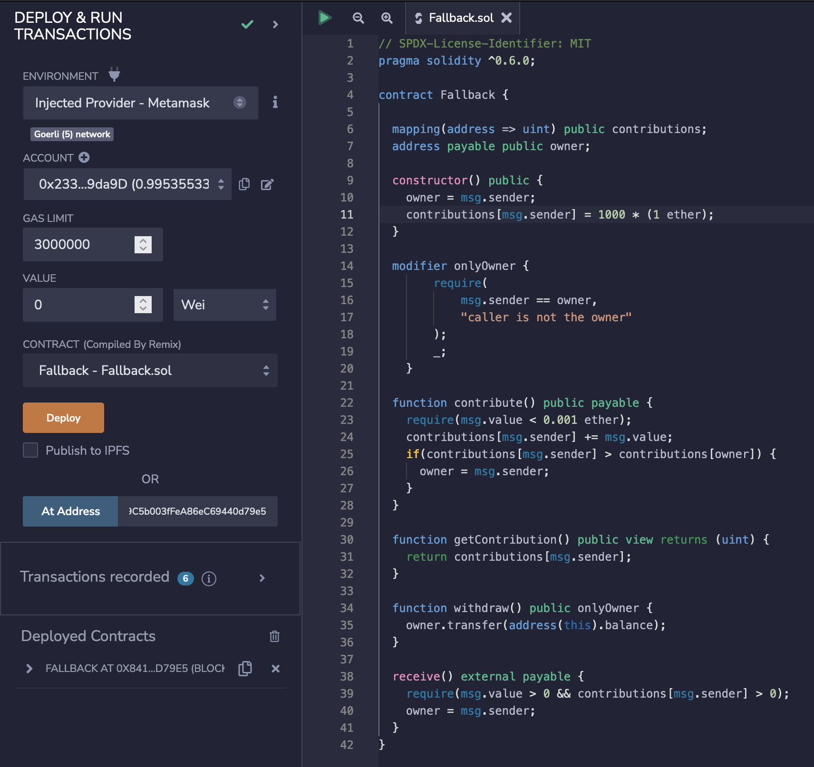

_English version down below_

# Contract

# Solución

### Para batir este nivel debemos conseguir:

    - Reclamar el ownership del contrato.
    - Reducir su balance a cero.

## Conectar el contrato a nuestra instacia desde Remix

En primer lugar compilamos el contrato, y lo conectamos a nuestra instancia con el botón "At Address", seleccionando como _Enviroment_ "Injected provider - Metamask" para que la red coincida con ella.

## Reclamar el ownership del contrato.

Si miramos el contrato, podemos observar que la forma de obtener el ownership del contrato es ejecutando la función _receive()_, la cual, al igual que la función _fallback()_ no pueden ser llamadas de manera directa, pero se ejecutan automáticamente cuando se hace una transferencia de ethers al contrato sin llamar a ninguna función existente, en el caso de _receive()_ se ejecutará cuando la transferencia no lleve parámetros y _fallback()_ cuando sí los tenga.

    receive() external payable {
        require(msg.value > 0 && contributions[msg.sender] > 0);
        owner = msg.sender;
    }

Además podemos obsevar que, para que la transacción no se revierta cuando se ejecute _receive()_, la dirección que envía los ethers debe haber contribuido con anterioridad al contrato, dato que se almacena en el mapping _mapping(address => uint) public contribution_

Para conseguirlo llamaremos a la función _contribute()_ enviando cualquier cantidad menor de 0.001 ethers, de esta forma registraremos nuestra address en el mapping _contribution_, pero no conseguiremos el ownership directamente, ya que para ello, nuestra aportación debería ser mayor que la del owner, la cual es de 1000 ethers, es decir, como solo podemos enviar menos de 0,001 ethers por llamada, deberíamos hacer más de 1 millón de transferencias para conseguirlo.

    contributions[msg.sender] = 1000 * (1 ether);

    function contribute() public payable {
        require(msg.value < 0.001 ether);
        contributions[msg.sender] += msg.value;
        if(contributions[msg.sender] > contributions[owner]) {
            owner = msg.sender;
        }
    }

El último paso para conseguir los derechos de propietario es enviar cualquier cantidad de ethers al contrato si llamar a nunguna funciçon, por ejemplo desde Metamask, esto hará que la función _receive()_ sea ejecutada y pasemos a ser el propietario.

## Reducir su balance a cero.

Para finalizar, solamente tendremos que llamar a la función _withdraw()_ lo que nos enviará todo el ether que contenga el contrato y lo dejará a cero.

    function withdraw() public onlyOwner {
        owner.transfer(address(this).balance);
    }

----------
----------

# Solution

### To beat this level we must achieve:

    - Claim ownership of the contract.
    - Reduce its balance to zero.

## Connect the contract to our instance from Remix

First, we compile the contract, and connect it to our instance with the button "At Address", selecting as _Enviroment_ "Injected provider - Metamask" so that the network matches with it.

## Claim the ownership of the contract.

If we look inside the contract, we can see that the way to obtain the ownership of the contract is by executing the _receive()_ function, which, like the _fallback()_ function, cannot be called directly, but they are executed automatically when a transfer of ethers is made to the contract without calling any existing function. _receive()_ will be executed when the transfer has no parameters and _fallback()_ when it does.

    receive() external payable {
        require(msg.value > 0 && contributions[msg.sender] > 0);
        owner = msg.sender;
    }

We can also note that, in order for the transaction not to be reverted by the _require_ when _receive()_ is executed, the address sending the ethers must have previously contributed to the contract, which is stored in the mapping _mapping(address => uint) public contribution_.

To get it, we will call the function _contribute()_ sending any amount less than 0.001 ethers, in this way we will register our address in the mapping _contribution_, but we will not get the ownership directly, because for that, our contribution should be greater than the owner's one, which is 1000 ethers, that is, as we can only send less than 0.001 ethers per call, we should make more than 1 million transfers to get it.

    contributions[msg.sender] = 1000 * (1 ether);

    function contribute() public payable {
        require(msg.value < 0.001 ether);
        contributions[msg.sender] += msg.value;
        if(contributions[msg.sender] > contributions[owner]) {
            owner = msg.sender;
        }
    }

The last step to get the owner rights is to send any amount of ethers to the contract without calling any function, for example from Metamask, this will cause the _receive()_ function to be executed and you become the owner.

## Reduce its balance to zero.

To finish, we will only have to call the _withdraw()_ function which will send you all the ether contained in the contract.